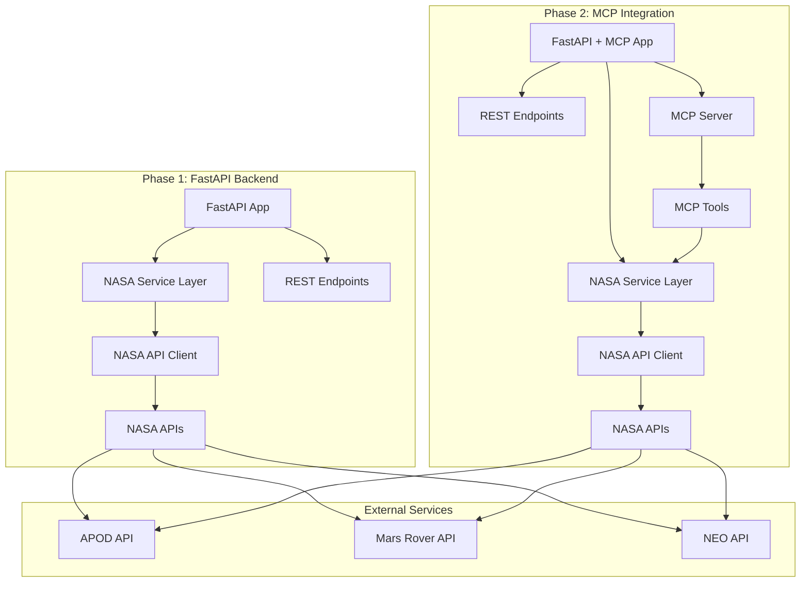

# Design Document

## Overview

The NASA MCP Demo is a two-phase educational project that demonstrates how to extend an existing FastAPI application with MCP (Model Context Protocol) capabilities. The project showcases integration with NASA's public APIs to create engaging space-related endpoints, then adds MCP server functionality using the fastapi_mcp library to make the same data accessible to AI models and MCP clients.

**Key Design Principles:**
- **Incremental Integration**: Show clear before/after states when adding MCP
- **Educational Focus**: Code structure optimized for learning and demonstration
- **Production Ready**: Follow best practices for real-world applications
- **Minimal Dependencies**: Keep the tech stack focused and manageable

## Architecture

### High-Level Architecture



### Technology Stack

**Core Framework:**
- FastAPI 0.104+ (latest stable)
- Python 3.11+
- Pydantic v2 for data validation
- httpx for async HTTP requests

**MCP Integration:**
- fastapi_mcp library for MCP server capabilities
- Standard MCP protocol implementation

**Development & Testing:**
- pytest for testing
- pytest-asyncio for async test support
- python-dotenv for environment management
- uvicorn for ASGI server

## Components and Interfaces

### 1. NASA API Client (`nasa_client.py`)

**Purpose**: Centralized client for all NASA API interactions with proper error handling and rate limiting.

**Key Methods:**
```python
class NASAClient:
    async def get_apod(self, date: Optional[str] = None) -> APODResponse
    async def get_mars_rover_photos(self, rover: str, sol: int, camera: Optional[str] = None) -> MarsRoverResponse
    async def get_neo_data(self, start_date: str, end_date: str) -> NEOResponse
    async def health_check(self) -> bool
```

**Features:**
- Async HTTP client using httpx
- Automatic retry logic with exponential backoff
- Rate limiting compliance (1000 requests/hour for demo key)
- Comprehensive error handling and logging
- Response caching for frequently requested data

### 2. NASA Service Layer (`nasa_service.py`)

**Purpose**: Business logic layer that processes NASA API responses and formats them for consumption.

**Key Methods:**
```python
class NASAService:
    async def get_daily_astronomy_picture(self, date: Optional[str] = None) -> ProcessedAPOD
    async def search_mars_photos(self, rover: str, sol: int, camera: Optional[str] = None) -> ProcessedMarsPhotos
    async def get_near_earth_objects(self, start_date: str, end_date: str) -> ProcessedNEOData
```

**Features:**
- Data transformation and enrichment
- Input validation and sanitization
- Business rule enforcement
- Caching strategy implementation

### 3. FastAPI Application (`main.py`)

**Phase 1 Structure:**
```python
app = FastAPI(
    title="NASA Data API",
    description="Educational demo for NASA API integration",
    version="1.0.0"
)

# Standard REST endpoints
@app.get("/apod")
@app.get("/mars-photos/{rover}")
@app.get("/neo")
@app.get("/health")
```

**Phase 2 Structure (MCP Integration):**
```python
from fastapi_mcp import MCPServer

app = FastAPI(...)
mcp_server = MCPServer(app)

# Existing REST endpoints remain unchanged
# New MCP tools added:
@mcp_server.tool()
async def get_astronomy_picture(date: Optional[str] = None) -> dict

@mcp_server.tool()
async def search_mars_rover_photos(rover: str, sol: int) -> dict

@mcp_server.tool()
async def find_near_earth_objects(start_date: str, end_date: str) -> dict
```

### 4. MCP Tools (`mcp_tools.py`)

**Purpose**: MCP-specific tool definitions that wrap the NASA service layer for AI model consumption.

**Design Considerations:**
- Tools return structured data optimized for AI processing
- Clear parameter descriptions for model understanding
- Consistent error handling across all tools
- Comprehensive docstrings for tool discovery

## Data Models

### Core Response Models

```python
# APOD (Astronomy Picture of the Day)
class APODResponse(BaseModel):
    date: str
    title: str
    explanation: str
    url: str
    media_type: str
    copyright: Optional[str] = None
    hdurl: Optional[str] = None

# Mars Rover Photos
class MarsPhoto(BaseModel):
    id: int
    img_src: str
    earth_date: str
    rover_name: str
    camera_name: str
    camera_full_name: str

class MarsRoverResponse(BaseModel):
    photos: List[MarsPhoto]
    rover: str
    sol: int
    total_photos: int

# Near Earth Objects
class NEOObject(BaseModel):
    id: str
    name: str
    estimated_diameter_km: dict
    is_potentially_hazardous: bool
    close_approach_date: str
    miss_distance_km: float
    relative_velocity_kmh: float

class NEOResponse(BaseModel):
    near_earth_objects: Dict[str, List[NEOObject]]
    element_count: int
    date_range: dict
```

### Configuration Models

```python
class NASAConfig(BaseModel):
    api_key: str = "DEMO_KEY"
    base_url: str = "https://api.nasa.gov"
    timeout: int = 30
    max_retries: int = 3
    rate_limit_per_hour: int = 1000

class AppConfig(BaseModel):
    nasa: NASAConfig
    enable_mcp: bool = False
    log_level: str = "INFO"
    cors_origins: List[str] = ["*"]
```

## Error Handling

### Error Hierarchy

```python
class NASAAPIError(Exception):
    """Base exception for NASA API related errors"""

class NASAAPIUnavailable(NASAAPIError):
    """NASA API is temporarily unavailable"""

class NASAAPIRateLimited(NASAAPIError):
    """Rate limit exceeded"""

class NASAAPIInvalidRequest(NASAAPIError):
    """Invalid request parameters"""

class MCPToolError(Exception):
    """Base exception for MCP tool errors"""
```

### Error Response Format

```python
class ErrorResponse(BaseModel):
    error: str
    message: str
    details: Optional[dict] = None
    timestamp: str
    request_id: str
```

### Error Handling Strategy

1. **NASA API Errors**: Graceful degradation with cached data when possible
2. **Validation Errors**: Clear parameter validation messages
3. **Rate Limiting**: Automatic retry with exponential backoff
4. **MCP Errors**: Structured error responses for AI model consumption
5. **Logging**: Comprehensive error logging for debugging

## Testing Strategy

### Test Categories

**1. Unit Tests**
- NASA client functionality
- Service layer business logic
- Data model validation
- Error handling scenarios

**2. Integration Tests**
- NASA API integration (with mocking)
- FastAPI endpoint testing
- MCP tool functionality
- End-to-end request flows

**3. MCP-Specific Tests**
- Tool discovery and invocation
- MCP protocol compliance
- Error handling in MCP context
- Concurrent MCP client handling

### Test Structure

```
tests/
├── unit/
│   ├── test_nasa_client.py
│   ├── test_nasa_service.py
│   └── test_models.py
├── integration/
│   ├── test_api_endpoints.py
│   ├── test_mcp_tools.py
│   └── test_error_handling.py
└── fixtures/
    ├── nasa_api_responses.json
    └── mcp_test_data.json
```

### Testing Approach

- **Mock NASA API responses** for consistent testing
- **Pytest fixtures** for common test data
- **Async test support** for all async operations
- **Coverage reporting** to ensure comprehensive testing
- **Performance testing** for concurrent MCP connections

## Implementation Phases

### Phase 1: FastAPI Backend (Baseline)
1. Project setup and configuration
2. NASA API client implementation
3. Service layer with business logic
4. REST API endpoints
5. Error handling and logging
6. Testing and documentation

### Phase 2: MCP Integration
1. Add fastapi_mcp dependency
2. Create MCP tool definitions
3. Integrate MCP server with existing FastAPI app
4. Update documentation with MCP examples
5. Add MCP-specific tests
6. Create demo scripts and usage examples

This design ensures a clear educational progression from a standard FastAPI application to one enhanced with MCP capabilities, making it perfect for demonstrating the integration process in your article.